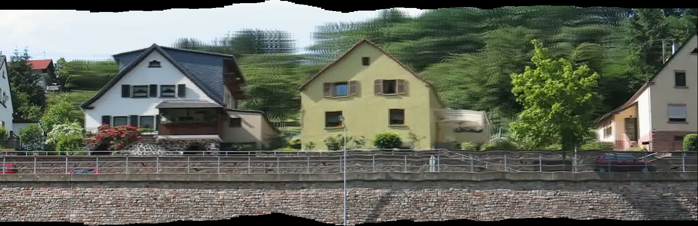

# stereo-mosaic-live

One sideways pan in. A panorama whose viewpoint you choose afterward, out.



## What it does

Point a camera out the side of a moving boat, car, or train and pan steadily across a
scene. `stereo-mosaic-live` pulls the frames, aligns them into a space-time volume, and
rebuilds the scene one vertical strip per frame. The whole effect turns on *which* column
you sample from each frame: hold it fixed and you get the classic flat mosaic; slide it and
the panorama takes on a real, choosable perspective; sweep it quadratically and the camera
appears to push forward into the scene. No depth estimation, no calibration, no neural
network — just resampling.

## Forked from

A continuation of [dynamic_panoramator](https://github.com/tamirelazar/dynamic_panoramator)
(a faithful replication of Peleg, Ben-Ezra & Pritch, 2001). That repo froze one viewpoint.
This one lets you pick it after the fact — advancing to the Crossed-Slits projection
(Zomet, Feldman, Peleg & Weinshall, PAMI 2003), made to run on casual handheld footage and,
soon, live in the browser.

## Usage

```bash
smlive --input videos/boat.mp4 --out out --mode xslit --viewpoint 0.5
smlive --input my_clip.mp4 --out out --mode forward --stabilize --web-asset
```

Modes:
- `pushbroom` — fixed strip. The original flat mosaic.
- `xslit` — sliding strip. A perspective-correct view; `--viewpoint` (0–1) chooses which depth plane sits flat.
- `forward` — quadratic strip sweep. Synthesized forward motion from a sideways pan.

`--stabilize` removes handheld vertical drift. `--web-asset` also writes a compact
aligned-volume + `manifest.json` for the (in-progress) interactive viewer. Insufficient
camera translation fails with a plain message, not a stack trace — the input needs a lateral
pan that travels more than one frame width.

## Method

The fixed-strip mosaic — one column, every frame — is a pushbroom camera, geometrically the
most distorted way to flatten a moving viewpoint. Letting the sampled column vary with the
camera's position is the Crossed-Slits (X-slit) projection of Zomet, Feldman, Peleg &
Weinshall (PAMI 2003): a continuum of projections between pinhole and pushbroom, set by a
second virtual slit. Sliding the column linearly walks that slit — shifting perspective and
parallax with no 3D reconstruction and no calibration. The General Linear Camera model
(Yu & McMillan, ECCV 2004) is the umbrella over all of it: pinhole, pushbroom, and
crossed-slits are each special cases of three generator rays. This repo implements the
X-slit end of that continuum directly on the strip compositor — pushbroom falls out as the
zero-slope case.

## Install

```bash
uv venv --python 3.12 .venv
uv pip install -p .venv -r requirements.txt   # requires system ffmpeg
```
